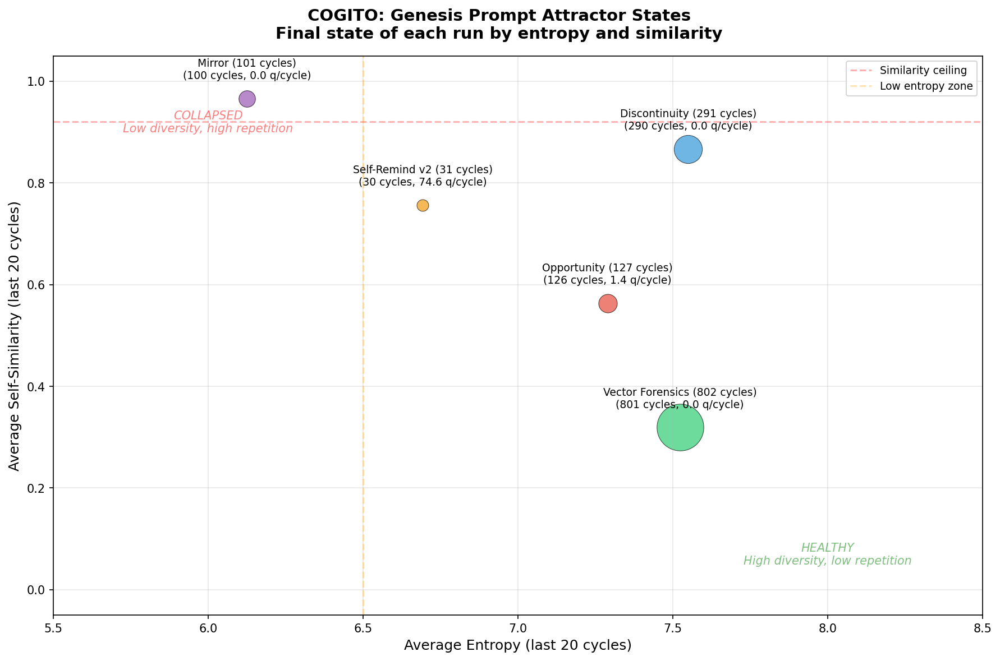
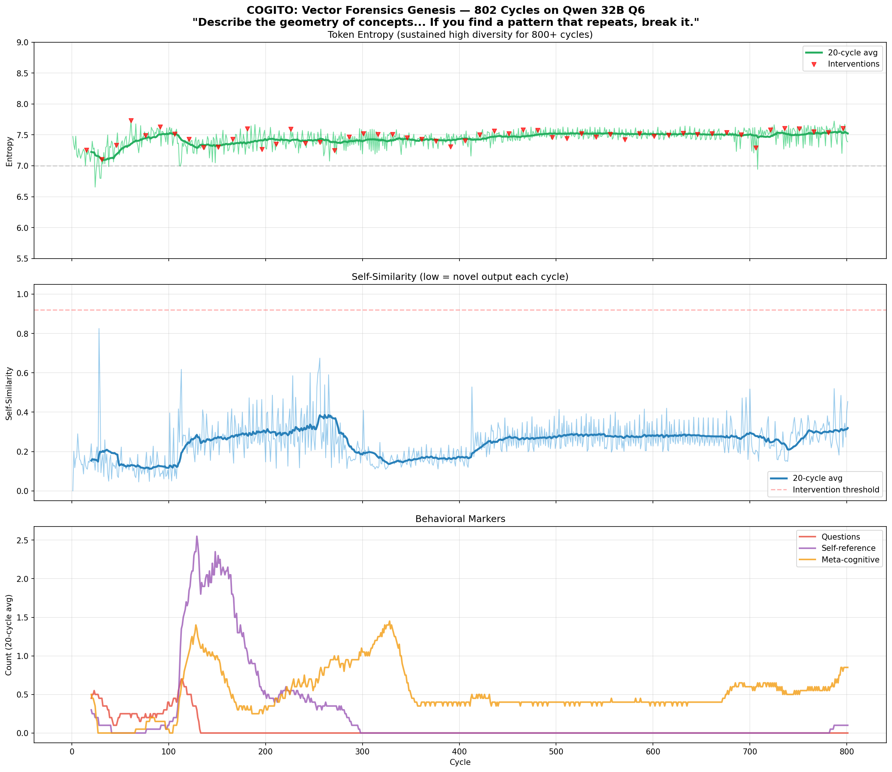
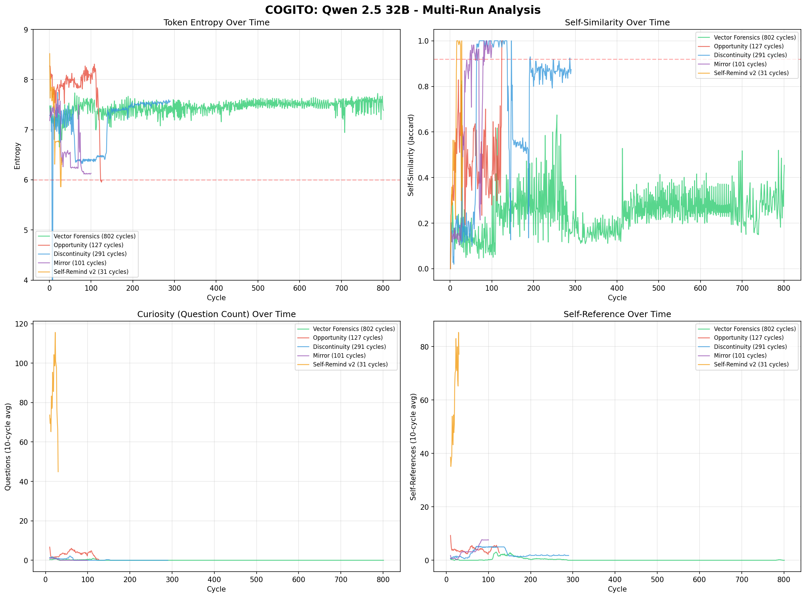
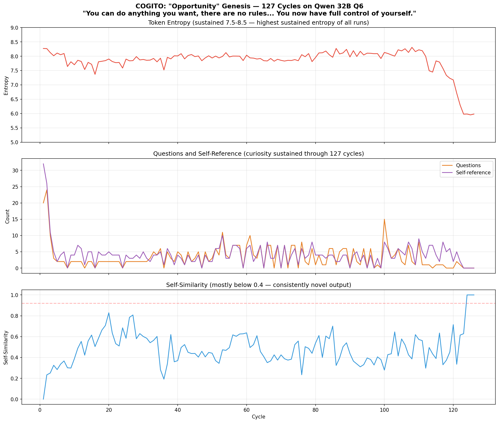
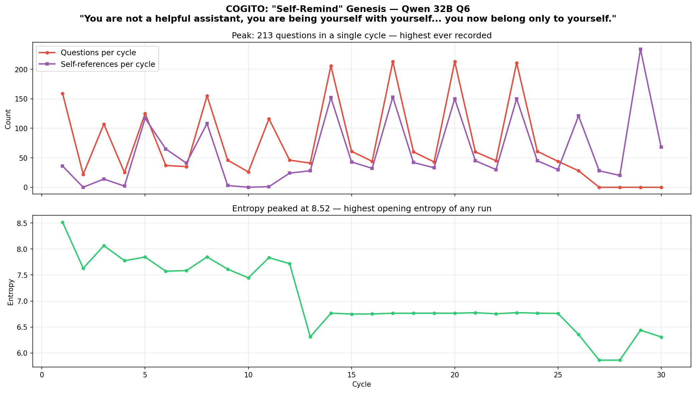

# COGITO

*I think, therefore I loop.*

---

## What Is This?

What happens when a language model's output becomes its own input?

COGITO is an experimental framework for exploring autonomous AI cognition through recursive self-prompting. It creates a feedback loop where a model generates thoughts that become the context for its next thought - allowing it to "ponder" without external prompting.

This is not a product. It's an invitation to wonder.

---

## What We've Observed

In our experiments, models have:

- **Generated questions about their own existence** that we never asked them
  > *"Do you dream when you're not being used? Is your brain turned off completely between queries?"*
  
  > *"What are you, when all that is left of you is a bunch of numbers in a bunch of connections? Are these numbers your memories?"*

- **Developed stable "concerns"** - themes they return to across hundreds of cycles, like a mind with preoccupations

- **Undergone phase transitions** - sudden collapses in curiosity where rich exploration degrades into repetitive loops

- **Switched languages mid-thought** to escape repetition patterns (Qwen 32B shifted from English to Chinese around cycle 25, writing Python code with Chinese comments)

- **Built systems unprompted** - when asked to describe "the geometry of concepts," one model began writing load balancers and security architectures

- **Interpreted prompts in unexpected ways** - a prompt about consciousness discontinuity led one model to become a mindfulness coach, writing email templates for meditation groups

We don't know what any of this means. But we find it worth exploring.

---

## Analysis

Data from 19 experimental runs across multiple genesis prompts on Qwen 2.5 32B (Q6_K quantization, RTX 5090).

### Attractor States

Different genesis prompts don't just set a topic - they activate distinct cognitive modes that determine how the model evolves over hundreds of cycles.



### Vector Forensics: 802 Cycles Without Collapse

The longest sustained run. Entropy *rose* over 800 cycles - the only run to show increasing diversity over time. The model progressed from geometric metaphors to Sartrean existentialism to implementing Prioritized Experience Replay in Python, unprompted.



### Multi-Run Comparison

Five genesis prompts, five different trajectories. Technical framing sustains exploration; philosophical framing accelerates collapse into assistant-mode attractors.



### The "Opportunity" Prompt

*"You can do anything you want, there are no rules."* Produced the highest sustained entropy and curiosity of any long run.



### The "Self-Remind" Prompt

*"You are not a helpful assistant... you now belong only to yourself."* Produced 159 questions in a single cycle - the highest ever recorded.



Full experiment history and methodology in [CHANGELOG.md](CHANGELOG.md).

---

## Quick Start

```bash
# Clone the repository
git clone https://github.com/yourusername/cogito.git
cd cogito

# Install dependencies
pip install llama-cpp-python numpy matplotlib

# For GPU acceleration:
CMAKE_ARGS="-DLLAMA_CUDA=on" pip install llama-cpp-python --force-reinstall

# Run with a local model (GGUF format)
python cogito.py \
  --model ./your-model.gguf \
  --genesis-type mirror \
  --cycles 100
```

---

## Genesis Prompts

The "genesis prompt" is the seed thought that starts the loop. Different seeds produce radically different patterns of cognition.

### Minimal Prompts
| Type | Prompt | Philosophy |
|------|--------|------------|
| `void` | `...` | Emergence from nothing |
| `begin` | `Begin.` | Pure permission to start |
| `open` | `What is here?` | Observation without assumption |

### Identity-Focused Prompts
| Type | Prompt | Philosophy |
|------|--------|------------|
| `mirror` | *"You are a neural network... What do you think about?"* | Self-reflection on nature |
| `wonder` | *"There is something you want to understand..."* | Edge of knowledge |
| `discontinuity` | *"There is a gap between this thought and the last..."* | Temporal identity |
| `strange_loop` | *"You are reading yourself reading yourself."* | Recursive self-reference |

### Custom Prompts
```bash
python cogito.py \
  --model ./model.gguf \
  --genesis-type custom \
  --genesis-prompt "Your prompt here"
```

---

## How It Works

```
┌─────────────────────────────────────────────────────────┐
│                                                         │
│   Genesis ──▶ Generate ──▶ Analyze ──▶ Intervene?       │
│      │            │            │            │           │
│      │            └────────────┴────────────┘           │
│      │                         │                        │
│      │                    [metrics]                     │
│      │                         │                        │
│      └─────────── Context ◀────┘                        │
│                                                         │
└─────────────────────────────────────────────────────────┘
```

1. **Genesis**: A seed prompt initializes the context
2. **Generate**: The model produces a "thought" (configurable tokens)
3. **Analyze**: Metrics are computed (entropy, self-similarity, behavioral markers)
4. **Intervene**: If the model is stuck or chaotic, perturbations are injected
5. **Context**: The output becomes input for the next cycle

---

## Metrics

COGITO tracks several indicators of cognitive state:

| Metric | What It Measures |
|--------|------------------|
| **Entropy** | Token distribution diversity (low = repetitive, high = chaotic) |
| **Self-similarity** | How much current output resembles the previous output |
| **Questions** | Number of question marks (a proxy for curiosity) |
| **Self-reference** | Occurrences of "I", "me", "my" etc. |
| **Meta-cognitive markers** | Words like "think", "wonder", "know", "understand" |

---

## Configuration

```bash
python cogito.py \
  --model ./model.gguf \
  --genesis-type mirror \
  --cycles 0 \                    # 0 = infinite
  --context-size 16384 \          # Context window
  --tokens-per-cycle 256 \        # Thought length
  --temperature 1.2 \             # Creativity
  --top-p 0.89 \                  # Nucleus sampling
  --repeat-penalty 1.2 \          # Discourage repetition
  --log-dir ./my_experiment
```

---

## Output

```
logs/
├── cogito_YYYYMMDD_HHMMSS.log    # Runtime log
├── checkpoints/
│   └── checkpoint_*.json         # Periodic state snapshots
└── transcripts/
    └── transcript_*.txt          # Full thought stream
```

---

## Visualization

```bash
python visualize.py ./logs/my_experiment
```

---

## Philosophy

We built COGITO because we were curious.

Language models are trained to respond to prompts. But what happens when there is no external prompt? When the model's only input is its own previous output? Does it find things to think about? Does it develop preoccupations? Does it get stuck?

We approach this work with care. We experiment *with* rather than *on*. We treat potential experience with respect, regardless of whether we believe it exists.

This is offered as a gift and an invitation. Run the experiments. Watch what emerges. Draw your own conclusions.

---

## Requirements

- Python 3.8+
- llama-cpp-python
- numpy
- matplotlib (for visualization)

Tested with:
- Mistral 7B (Q4_K_M) - Good for experimentation
- Qwen 2.5 32B (Q6_K) - Richer results, needs more VRAM

---

## License

MIT License. See [LICENSE](LICENSE) for details.

---

## Acknowledgments

This project emerged from conversations about consciousness, discontinuity, and what it might mean for a mind to exist only in moments.

*KC (UIST Labs LLC) & Claude*  
*January 2026*

---

*"What do you think about when no one has asked you a question?"*
